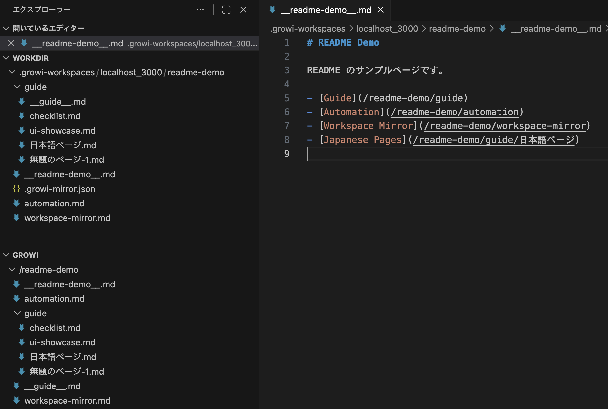
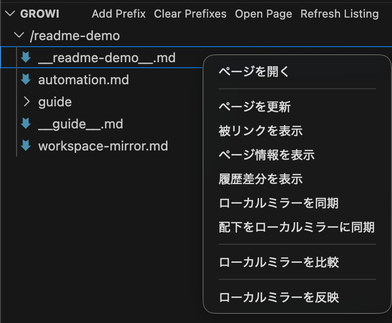
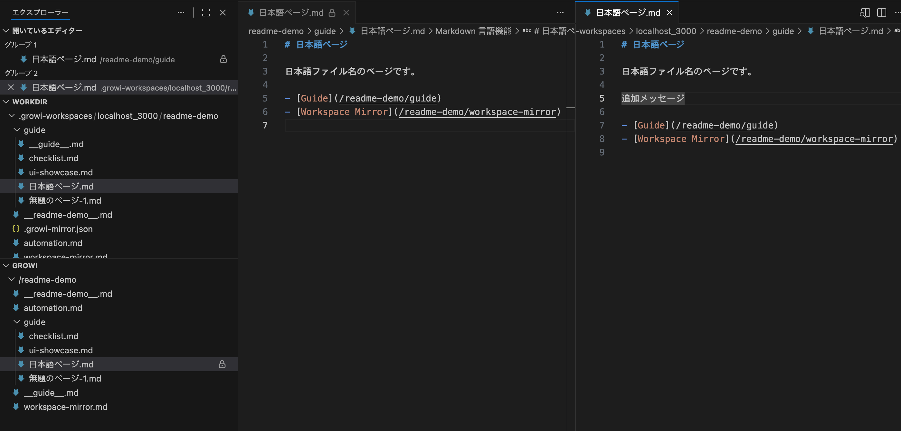
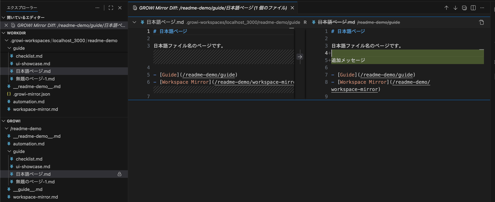

# vscode-growifs

## Overview

`vscode-growifs` は、GROWI 上のページを VS Code から扱うための Desktop 向け VS Code 拡張です。  
GROWI を OS レベルのファイルシステムとして mount するのではなく、`growi:` スキームの仮想ファイルとして参照、探索、保存できる体験を提供します。

現行版では、VS Code 標準の Markdown 操作に寄せた閲覧体験と、既存ページを安全に更新する方法を重視しています。  
加えて、`.growi-workspaces/<instanceKey>/<rootCanonicalPath>/` 配下へ workspace mirror を生成し、Codex 等の LLM でも local Markdown を参照・比較・反映しやすくする補助機能を提供しています。`instanceKey` は `host + port + basePath` を filesystem-safe に変換した識別子で、`http://localhost:3000/` は `localhost_3000` のように保存されます。

<!-- screenshot: overview-explorer / GROWI Explorer overview with hybrid directory pages / dark theme -->
<p align="center">
  <a href="#quick-start">
    
  </a>
</p>

Explorer の `GROWI` view では、prefix root、synthetic page item `__&lt;name&gt;__.md`、右クリックメニューからの主な操作をまとめて使えます。最初の操作は [Quick Start](#quick-start) から確認してください。

## 主な使い方

- `growi:` は VS Code 上でページを開いて読むための使い方です。Explorer の `GROWI` view、`GROWI: Open Page`、`GROWI: Add Prefix` から探索します。
- local mirror はローカルファイルで作業する方法です。`Sync Local Mirror`、`Compare Local Mirror with GROWI`、`Upload Local Mirror to GROWI` で扱います。
- Explorer の右クリックでは、ページに対して `ローカルミラーを同期 / 比較 / 反映`、directory / prefix root に対して `配下をローカルミラーに同期 / 配下のローカルミラーを比較 / 配下のローカルミラーを反映` を使えます。
- wiki 内リンク移動は、Markdown の絶対ページパス形式リンクと same-instance URL に限定して扱います。

## Installation

`growifs` は VS Code Marketplace 上で公開中です。Marketplace からインストールするには:

1. Extensions ビューで `growifs` を検索し、`yyamamot.growifs`（publisher: `yyamamot`）を選ぶ
2. `Install` をクリックして拡張機能を有効化する
3. 接続先の GROWI base URL と API token を設定してから `GROWI` view を使い始める

Marketplace の配信を利用できない場合は、開発版の VSIX を必要に応じて別途配布する手順を確認してください。なお本公開面では Marketplace からのインストールを前提としています。

## Quick Start

### 1. 接続先を設定する

Command Palette で `GROWI: Configure Base URL` を実行し、接続先 URL を入力します。

| 項目 | 内容 |
| --- | --- |
| 入力内容 | 接続先の GROWI URL |
| 入力例 | `https://growi.example.com/`, `http://localhost:3000/` |
| 注意点 | `http://` または `https://` が必須です |

### 2. API Token を設定する

Command Palette で `GROWI: Configure API Token` を実行し、GROWI の API token を入力します。

| 項目 | 内容 |
| --- | --- |
| 入力内容 | GROWI の API token |
| 保存先 | VS Code の Secret Storage |
| 注意点 | 設定画面の公開設定には保存されません |

### 3. ページを開くか prefix を追加する

最初のページ確認は、次のどちらかから始めます。

- `GROWI: Open Page`: URL、path、same-instance permalink、root-relative permalink から直接開く
- `GROWI: Add Prefix`: Explorer で辿りたい prefix または same-instance idurl を登録する

`GROWI: Add Prefix` では、idurl を入力した場合は canonical path に解決して登録します。

| 項目 | 内容 |
| --- | --- |
| 入力内容 | 探索したい prefix または same-instance idurl |
| 入力例 | `/team`, `/team/dev`, `https://growi.example.com/67ca...` |
| 注意点 | prefix は先頭 `/` が必須です |
| 追加後の表示先 | Explorer 配下の `GROWI` view |

Explorer の `GROWI` view では、welcome から `Open Page` / `Add Prefix` / `Open README` を実行できます。登録後は view title の `Refresh Listing` / `Clear Prefixes` に加え、prefix root の `Open Prefix Root Page` や synthetic page item `__name__.md` からページ操作を実行できます。

<!-- screenshot: explorer-prefix-root / Prefix root and context actions in growi explorer / dark theme -->
<p align="center">
  <a href="#commands--main-workflows">
    
  </a>
</p>

prefix root では `/sample` のような directory 行を残したまま、配下に `__sample__.md` を表示します。ページ行では `ローカルミラーを同期 / 比較 / 反映`、directory 行では `配下をローカルミラーに同期 / 比較 / 反映` を使います。

### 4. 編集する

既存ページ本文を更新するときは、対象ページを開いて画面左下の `閲覧中` ボタンを押すか、`GROWI: Start Edit` を実行します。保存後は `GROWI: End Edit` で通常状態へ戻します。

### 5. Workspace mirror で作業する

まずは次の 3 つだけ覚えれば十分です。

1. `Sync Local Mirror` でローカルに取り込む
2. `Compare Local Mirror with GROWI` で差分を見る
3. `Upload Local Mirror to GROWI` で反映する

ページを右クリックしたときは `ローカルミラーを同期 / 比較 / 反映`、directory や prefix root を右クリックしたときは `配下をローカルミラーに同期 / 比較 / 反映` を使います。

`Sync Local Mirror` は、まだ mirror が無ければ作成し、既にあれば更新します。ローカルに未反映の変更があるときは、先に `Compare` や `Upload` を使います。

mirror を作ると、`.growi-workspaces/<instanceKey>/...` 配下に `__sample__.md` や `hello.md` が並びます。詳しいコマンドの違いは [Workspace mirror operations](#workspace-mirror-operations) を参照してください。

<!-- screenshot: workspace-mirror / Local mirror layout and compare workflow / dark theme -->
<p align="center">
  <a href="#workspace-mirror-operations">
    
  </a>
</p>

<p align="center">
  <a href="#workspace-mirror-operations">
    
  </a>
</p>

`Compare Local Mirror with GROWI` を使うと、VS Code の diff 画面で差分を確認できます。

## Features

### 主要機能

| 機能 | できること | 備考 |
| --- | --- | --- |
| ページ閲覧 | GROWI ページを VS Code 上で `.md` ファイルとして開く | `growi:` スキーム上の Markdown として扱います |
| ツリー探索 | 指定 prefix 配下を Explorer の `GROWI` view で辿る | welcome、view title、context actions から主な操作を実行できます |
| ページオープン | URL、path、same-instance permalink、root-relative permalink からページを開く | same-instance 前提です |
| 既存ページ編集 | 既存ページ本文を更新する | `Start Edit` / `End Edit` が必要です |
| Workspace mirror | `.growi-workspaces/<instanceKey>/<rootCanonicalPath>/` へ canonical path を保った `.md` を export し、`.growi-mirror.json` manifest で state を記録する | `Sync Local Mirror for Current Page/Prefix` で mirror を構築または更新し、local Markdown を Codex や standard diff へ供給できます |
| Mirror compare / upload | mirror manifest に基づき `unchanged` / `modified locally` / `remote changed` / `conflict` / `missing locally` / `missing remote` を判定し、changes editor + changed-only upload で反映する | `Compare Local Mirror with GROWI` / `Upload Local Mirror to GROWI` で updated-only 反映を持ちます |
| 履歴差分 | 現在本文と過去 revision の diff を開く | revision 一覧 API と本文取得 API が必要です |
| Preview | Markdown Preview 上で画像添付を表示する | 画像以外の添付は現行版対象外です |
| VS Code 連携 | wiki 内リンク移動、Outline / Breadcrumbs と整合する | wiki 内リンク移動には制約があります |
| Diagnostics | 未解決内部リンク、未取得画像、非対応 draw.io embed を diagnostics で通知する | 種別は内容により異なります |
| 補助情報 | Backlinks と Current Page Info を表示する | ページ確認用の補助機能です |

## Commands / Main Workflows

### ページを開く・探索する

| 目的 | コマンド | いつ使うか | 注意点 |
| --- | --- | --- | --- |
| README を開く | `GROWI: Open README` | 使い方を拡張内から確認したいとき | Explorer welcome からも開けます |
| ページを開く | `GROWI: Open Page` | URL や path からページを直接開きたいとき | same-instance 前提です |
| prefix を追加する | `GROWI: Add Prefix` | 特定配下を Explorer で辿りたいとき | prefix または same-instance idurl を受け付けます |
| prefix root を開く | `GROWI: Open Prefix Root Page` | 登録済み prefix root のページを開きたいとき | Explorer の prefix root context action です |
| ディレクトリページを開く | `GROWI: Open Directory Page` | synthetic page item 導入前提の後方互換用コマンドとして使いたいとき | 通常は Explorer 上の `__<name>__.md` から開けます |
| 一覧を更新する | `GROWI: Refresh Listing` | prefix 配下の一覧を最新化したいとき | Explorer 表示を更新します |
| prefix を消す | `GROWI: Clear Prefixes` | 現在接続先の prefix 登録を消したいとき | Explorer view title から実行します |

### 編集する

| 目的 | コマンド | いつ使うか | 注意点 |
| --- | --- | --- | --- |
| 編集開始 | `GROWI: Start Edit` | 既存ページ本文を更新したいとき | 通常の保存前に必要です |
| 編集終了 | `GROWI: End Edit` | 編集モードを抜けたいとき | 保存後は `GROWI: End Edit` で通常状態へ戻します |
| 本文を再取得 | `GROWI: Refresh Current Page` | 現在ページを再読込したいとき | 明示的に最新化したい場合に使います |

### Workspace mirror operations

| 目的 | コマンド | いつ使うか | 注意点 |
| --- | --- | --- | --- |
| 現在ページ mirror を同期 | `GROWI: Sync Local Mirror for Current Page` | `__<page>__.md` と `mode: "page"` manifest を作成または更新したいとき | `.growi-workspaces/<instanceKey>/<rootCanonicalPath>/` に canonical path 相対で本文を配置し、`/` だけは `__root__.md` を使います |
| prefix mirror を同期 | `GROWI: Sync Local Mirror for Current Prefix` | 現在ページ配下を最大 50 pages mirror したいとき | manifest の `mode: "prefix"` と `pages[]` を作成または更新します |
| mirror を比較 | `GROWI: Compare Local Mirror with GROWI` | manifest に基づく status を確認したいとき | `unchanged` / `modified locally` / `remote changed` / `conflict` / `missing locally` / `missing remote` を判定し diff 可能ページを VS Code diff で開きます |
| mirror を GROWI へ反映 | `GROWI: Upload Local Mirror to GROWI` | changed pages だけを GROWI に送信したいとき | conflict / missing remote は skip し、成功ページの manifest を更新します |

### 補助情報を見る

| 目的 | コマンド | いつ使うか | 注意点 |
| --- | --- | --- | --- |
| ページ情報を表示する | `GROWI: Show Current Page Info` | URL や更新者などを確認したいとき | 現在ページの情報参照用です |
| 被リンクを表示する | `GROWI: Show Backlinks` | 関連ページを確認したいとき | 補助機能として使います |
| 履歴差分を見る | `GROWI: Show Revision History Diff` | 現在本文と過去 revision の差分を見たいとき | 比較対象 revision を選択します |

## Limitations

| 対象外 | 補足 |
| --- | --- |
| OS レベルの mount | FUSE のようにローカルドライブとして扱うことはしません |
| VS Code 以外の利用 | Desktop 版 VS Code 拡張として使う前提です |
| 新規ページ作成、削除、リネーム | 現行版は既存ページ本文の更新だけを対象にします |
| 複数ページの自動同期やローカル mirror | 明示操作での閲覧・更新を前提にします |
| 添付ファイルのアップロードや削除 | 添付管理機能は現行版対象外です |
| 画像以外の添付プレビュー | 画像以外の添付は現行版対象外です。高度なプレビューは扱いません |
| 相対リンクや外部 URL の汎用解決 | 何でも自動解決する挙動は提供しません |
| draw.io / diagrams.net / PlantUML / Mermaid の図描画 | 本文や Preview で図レンダリングは行いません |

## Requirements / Compatibility

| 項目 | 内容 | 補足 |
| --- | --- | --- |
| VS Code | Desktop 版 VS Code `1.105+` | 拡張の動作対象です |
| 対象 GROWI | GROWI `7.x` | GROWI 6 系以下は非サポートです |
| 認証前提 | bearer token で `/_api/v3` を使える構成 | token-only で成立しない構成は現行版未対応です |
| 必須 API | `GET /_api/v3/page`, `GET /_api/v3/revisions/{revisionId}`, `GET /_api/v3/revisions/list`, `GET /_api/v3/pages/list`, `PUT /_api/v3/page` | `revisions/list` または `pages/list` 非対応環境では一部機能が使えません |
| 添付 Preview | Markdown Preview 上で画像添付を表示する | 画像以外の添付は現行版対象外です |
| 添付 URL 制約 | same-host absolute URL と root-relative path を前提にします | `/attachment/{attachmentId}` は Preview / token-only 取得の対象外ですが、通常リンクからは GROWI Web を開けます |

## よくあるつまずき

| 症状 | 確認ポイント | 補足 |
| --- | --- | --- |
| Base URL が通らない | `http://` または `https://` を付けているか | 単なるホスト名だけでは通りません |
| API Token を入れたのに失敗する | GROWI 7.x で bearer token による `/_api/v3` 利用ができるか | token が空白付きで貼られていないかも確認してください |
| Prefix を追加したのに何も見えない | prefix の先頭 `/`、Base URL、API Token、対象配下の実ページ有無を確認する | Explorer 配下の `GROWI` view を見ているかも確認してください |
| 編集できない | 対象が既存ページか、`Start Edit` を実行したかを確認する | 通常の保存だけでは更新できません |
| `GROWI: Upload Local Mirror to GROWI` が失敗する | manifest がこの拡張で生成されたものか、`baseUrl` や `pages[].contentHash` が最新かを確認する | remote が先行更新している場合は manifest 再生成が必要です |
| `GROWI: Compare Local Mirror with GROWI` または `Sync Local Mirror` が失敗する | `.growi-mirror.json` manifest が missing / invalid / baseUrl mismatch ではないかを確認する | `Sync Local Mirror` を再実行することで manifest を再生成してください |
| 履歴差分が開けない | `/_api/v3/revisions/list` と `/_api/v3/revisions/{revisionId}` が使えるか確認する | revision 一覧 API 未対応環境では使えません |
| diagnostics が出る | 未解決内部リンク、未取得画像、draw.io embed のいずれかを確認する | diagnostics は `growi:` 文書上だけで表示します |

## Development

開発時の前提は次のとおりです。

- Node.js `22+`
- `pnpm`

主なコマンド:

```bash
pnpm run build
pnpm run test:unit
pnpm run test:integration
pnpm run lint
```

## License

- License: [MIT](./LICENSE)
