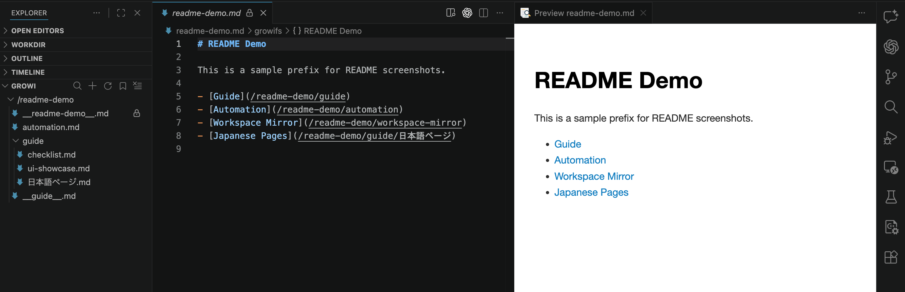
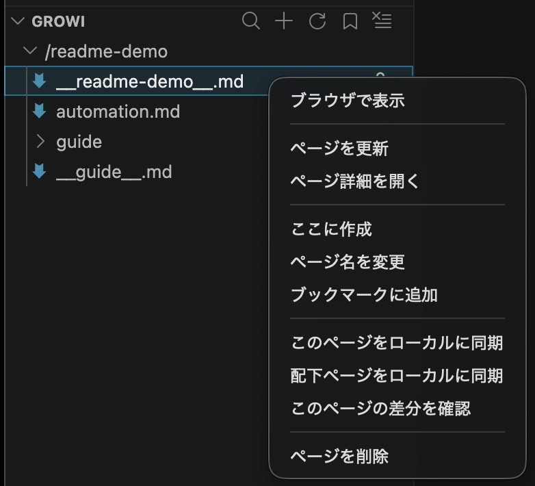
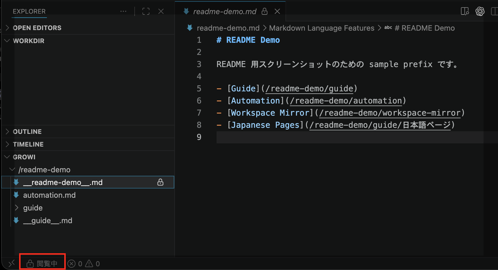
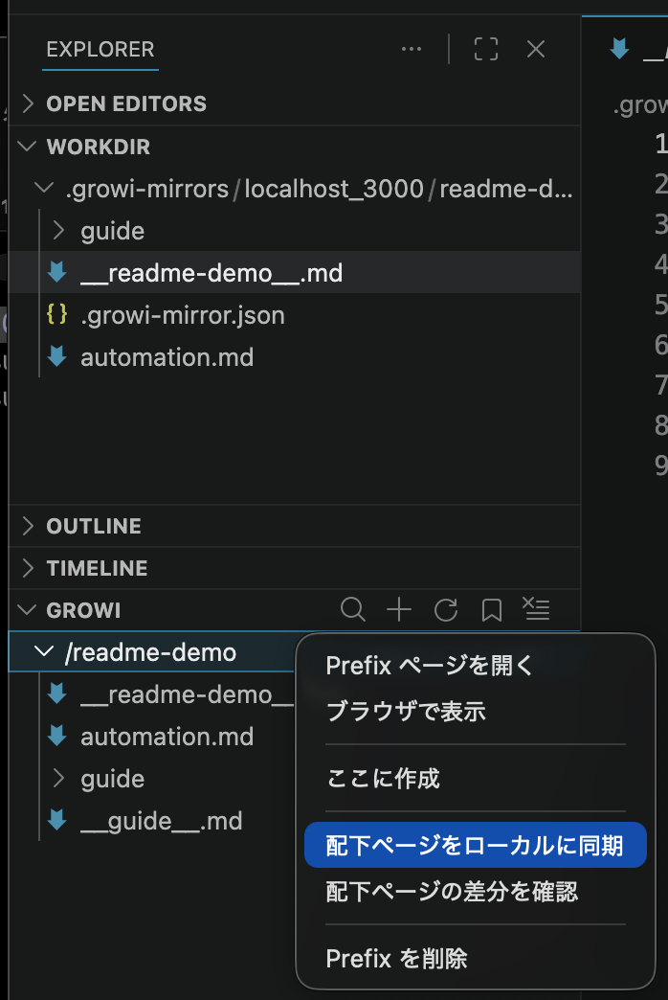
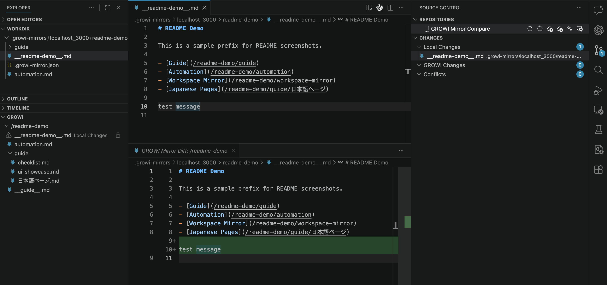

# vscode-growifs

`vscode-growifs` は、GROWI のページを VS Code から閲覧、編集、探索するための Desktop 向け VS Code 拡張です。

GROWI を OS のファイルシステムとして mount するのではなく、`growi:` スキームの仮想 Markdown ファイルとして扱います。ページツリーは VS Code のワークスペースへ追加せず、Explorer 配下の専用 `GROWI` view と Command Palette から操作します。

加えて、ローカルミラー機能により GROWI ページを Markdown ファイルとして書き出せます。Codex などの LLM がローカル Markdown を直接参照しやすくなり、VS Code の diff や Source Control view と組み合わせて、GROWI 側との差分確認や反映まで進められます。

<!-- screenshot: overview-explorer / GROWI Explorer overview with hybrid directory pages / dark theme -->
<p align="center">
  <a href="#quick-start">
    
  </a>
</p>

## Features

| 機能 | 内容 |
| --- | --- |
| ページ閲覧 | GROWI ページを VS Code 上の Markdown として開きます |
| Explorer 探索 | 登録した prefix 配下を専用 `GROWI` view で辿れます |
| ページ作成 | GROWI の階層テンプレートがあれば本文へ適用して新規ページを作成します |
| 編集 | `Start Edit` / `End Edit` または status bar から編集状態を切り替えます |
| ページ名変更 / ページ削除 | 現在ページや Explorer item からページ名変更、ゴミ箱への削除を実行できます |
| 添付参照 | 現在ページの添付一覧を Quick Pick で表示し、GROWI Web で開けます |
| 履歴差分 | 現在本文と過去 revision の diff を開けます |
| 被リンク表示 | 追加済み prefix 範囲で現在ページへの参照元を探します |
| ローカルミラー | GROWI ページをローカル Markdown として同期し、LLM から参照しやすくしながら差分確認と反映を行えます |

## Installation

VS Code Marketplace からインストールする場合:

1. Extensions ビューで `growifs` を検索する
2. `yyamamot.growifs` を選ぶ
3. `Install` をクリックする
4. 接続先の GROWI base URL と API token を設定する

## Quick Start

### 1. Base URL を設定する

Command Palette で `GROWI: Configure Base URL` を実行し、接続先の GROWI URL を入力します。

| 項目 | 内容 |
| --- | --- |
| 入力例 | `https://growi.example.com/`, `http://localhost:3000/` |
| 注意点 | `http://` または `https://` が必要です |

### 2. API token を設定する

Command Palette で `GROWI: Configure API Token` を実行し、GROWI の API token を入力します。token は VS Code の Secret Storage に保存され、設定ファイルには書き込まれません。

### 3. ページを開く

まずは `GROWI: Open Page` を実行します。次の形式を受け付けます。

- ページパス: `/team/dev` のような GROWI 内のページ位置
- GROWI のページ URL: ブラウザで開いているページの URL
- GROWI の固定リンク URL: ページ ID を含む共有用 URL

`Open Page` は登録済み prefix 配下の page path / basename 候補も表示します。接続先全体を対象にした全文検索は行いません。

### 4. prefix を追加して Explorer で辿る

`GROWI: Add Prefix` を実行し、探索したい prefix を登録します。

| 項目 | 内容 |
| --- | --- |
| 入力例 | `/team`, `/team/dev`, `https://growi.example.com/67ca...` |
| 表示先 | Explorer 配下の `GROWI` view |

Explorer の `GROWI` view では、view title actions から `Open Page`、`Add Prefix`、`Refresh Listing`、`Show Bookmarks`、`Clear Prefixes` を実行できます。右クリックからは `ページを開く`、`ブラウザで表示`、`ここに作成`、`ページ名を変更`、`ページを削除`、`被リンクを表示`、ローカルミラー操作などを実行できます。

<!-- screenshot: explorer-prefix-root / Prefix root and context actions in growi explorer / dark theme -->
<p align="center">
  <a href="#commands">
    
  </a>
</p>

GROWI では directory と同じ名前のページが存在できます。この拡張では directory 行とは別に、同名の実ページを `__<name>__.md` として表示します。

### 5. 編集する

既存ページを編集するときは、対象ページを開いてから `GROWI: Start Edit` を実行します。status bar の `$(lock) 閲覧中` からも切り替えできます。

編集中は status bar が `$(unlock) 編集中` になります。保存後は `GROWI: End Edit` で閲覧状態へ戻します。

保存できるのは編集状態のページだけです。通常の閲覧状態では誤って保存しないように保護されます。

<!-- screenshot: edit-mode / Status bar edit mode toggle and protected save state / dark theme -->
<p align="center">
  <a href="#commands">
    
  </a>
</p>

## ローカルミラーと Source Control

ローカルミラーは、GROWI ページをローカル Markdown として扱いたいときの補助機能です。通常の閲覧や編集に必須ではありません。

基本の流れは次の 3 段階です。

1. `このページをローカルに同期` または `配下ページをローカルに同期` でローカルへ同期する
2. `このページの差分を確認` または `配下ページの差分を確認` で差分を確認する
3. Source Control view の `GROWIに反映` または `ローカルに取り込む` で必要なページだけ反映する

<!-- screenshot: local-mirror / Local mirror layout and compare workflow / dark theme -->
<p align="center">
  <a href="#ローカルミラーと-source-control">
    
  </a>
</p>

<p align="center">
  <a href="#ローカルミラーと-source-control">
    
  </a>
</p>

ミラーは workspace 内の `.growi-mirrors/<instanceKey>/<rootCanonicalPath>/` 配下に作成されます。`instanceKey` は `host + port + basePath` を filesystem-safe に変換した識別子で、`http://localhost:3000/` は `localhost_3000` のように保存されます。通常の Markdown ファイルとして開けるため、VS Code の検索、diff、編集機能をそのまま使えます。

配下ページをまとめて同期する場合の既定上限は 50 pages です。VS Code 設定 `growi.localMirror.maxPrefixPages` で変更できますが、200 pages を超える値は 200 に丸められます。巨大な subtree を同期したい場合は、prefix を分ける運用を推奨します。

Source Control view には、最後に成功した compare 結果が `GROWI Mirror Compare` として表示されます。

| 表示 | 意味 |
| --- | --- |
| `ローカルの変更` | ローカルミラー側に未反映の変更があります |
| `GROWI側の変更` | GROWI 側の revision が mirror 作成時から進んでいます |
| `競合` | ローカルミラーと GROWI 側の両方に変更があります |

ローカルミラー配下の Markdown を保存すると、Source Control view の `ローカルの変更` に反映されます。GROWI 側の差分や競合の詳細は、`このページの差分を確認`、`配下ページの差分を確認`、または Source Control view の `再比較` で確認してください。

## Commands

主な操作は Explorer の `GROWI` TreeView で対象ページや directory を右クリックして実行できます。同じ操作の多くは Command Palette からも実行できます。以下は Command Palette で使える主なコマンド一覧です。

### 接続と探索

| コマンド | 用途 |
| --- | --- |
| `GROWI: Configure Base URL` | 接続先 GROWI URL を設定する |
| `GROWI: Configure API Token` | API token を Secret Storage に保存する |
| `GROWI: Open README` | この README を開く |
| `GROWI: Open Page` | path / URL / permalink からページを開く |
| `GROWI: Add Prefix` | Explorer の `GROWI` view に探索 prefix を追加する |
| `GROWI: Refresh Listing` | prefix 配下の一覧を更新する |
| `GROWI: Clear Prefixes` | 現在接続先の prefix 登録を削除する |
| `GROWI: Show Bookmarks` | GROWI root bookmarks を再訪候補として表示する |

### ページ操作

| コマンド | 用途 |
| --- | --- |
| `GROWI: Create Page` | 新規ページを作成する |
| `GROWI: Start Edit` | 既存ページの編集を開始する |
| `GROWI: End Edit` | 編集状態を終了する |
| `GROWI: Refresh Current Page` | 現在ページを再取得する |
| `GROWI: Rename Page` | 現在ページの canonical path を変更する |
| `GROWI: Delete Page` | 現在ページをゴミ箱へ移動する |
| `GROWI: Show Current Page Actions` | 現在ページで使える操作を Quick Pick で表示する |

### 補助情報

| コマンド | 用途 |
| --- | --- |
| `GROWI: Show Current Page Info` | 現在ページの URL、path、更新者などを表示する |
| `GROWI: Show Current Page Attachments` | 現在ページの添付一覧を表示する |
| `GROWI: Show Backlinks` | 追加済み prefix 範囲で被リンクを探す |
| `GROWI: Show Revision History Diff` | 過去 revision と現在本文の diff を開く |

### ローカルミラー

| コマンド | 用途 |
| --- | --- |
| `GROWI: Sync Local Mirror for Current Page` | 現在ページをローカルミラーへ同期する |
| `GROWI: Sync Local Mirror for Current Prefix` | 現在ページ配下をローカルミラーへ同期する |
| `GROWI: Compare Local Mirror with GROWI` | ローカルミラーと GROWI 側を比較する |
| `GROWI: Upload Local Mirror to GROWI` | ローカルミラーの変更を GROWI へ反映する |
| `再比較` | Source Control view の compare 結果を再取得する |
| `GROWI側の更新を確認` | Source Control view から GROWI 側の更新有無を確認する |
| `GROWIに反映` | Source Control view の選択 resource を GROWI へ反映する |
| `ローカルに取り込む` | GROWI 側で更新された resource をローカルミラーへ取り込む |

## Settings

| 設定 | 既定値 | 内容 |
| --- | --- | --- |
| `growi.baseUrl` | `""` | 接続先 GROWI URL |
| `growi.pageListing.initialPageSize` | `100` | prefix 一覧の初回取得件数 |
| `growi.pageListing.maxAutoPagesPerPrefix` | `300` | `Open Page` の入力後に prefix ごとに自動探索する最大件数 |
| `growi.localMirror.maxPrefixPages` | `50` | 配下ページをローカルに同期するときの最大 page 数。最大 200 まで |

API token は VS Code Secret Storage に保存するため、設定項目には含まれません。

## Requirements / Compatibility

| 項目 | 内容 |
| --- | --- |
| VS Code | Desktop 版 VS Code `1.105+` |
| GROWI | GROWI `7.x` |
| 認証 | GROWI API token |
| API | GROWI 7.x のページ取得、一覧取得、保存、作成、ページ名変更、削除、revision、bookmark、attachment 関連機能 |

一部 API が使えない GROWI 環境では、対応する機能だけが利用できない場合があります。

## Limitations

| 対象外 | 補足 |
| --- | --- |
| OS レベルの mount | FUSE のようなローカルドライブ化はしません |
| VS Code 以外の汎用クライアント利用 | Desktop 版 VS Code 拡張として使う前提です |
| 複数 GROWI 接続の同時表示 | 一度に扱える接続先は現在設定中の base URL です |
| 接続先全体の全文検索 | `Open Page` は登録済み prefix 配下の候補検索が主経路です |
| 完全削除 / 復元 | `GROWI: Delete Page` はゴミ箱への移動です |
| 添付のアップロード / 削除 / 本文挿入 | 現行版対象外です |
| 画像以外の添付 preview | 添付一覧から GROWI Web で開く導線に留めます |
| `FILE_UPLOAD=local` の `/attachment/{attachmentId}` Preview | login session / cookie 依存のため token-only preview 対象外です |
| 相対リンクや外部 URL の汎用解決 | wiki 内リンク移動は same-instance 前提です |
| draw.io / diagrams.net / PlantUML / Mermaid の図描画 | 現行版では図レンダリングしません |
| 自動 merge | ローカルミラー反映時も曖昧な場合は conflict / skip に倒します |

## Troubleshooting

| 症状 | 確認ポイント |
| --- | --- |
| Base URL が通らない | `http://` または `https://` を付けているか確認してください |
| API token で失敗する | GROWI 7.x の API token が有効か、token に余分な空白がないか確認してください |
| prefix を追加しても何も見えない | prefix が `/` で始まるか、対象配下に実ページがあるか、Base URL / API token が正しいか確認してください |
| ページを保存できない | `GROWI: Start Edit` で編集状態に入っているか確認してください |
| 添付画像が Preview に出ない | token-only で取得できる same-host URL か確認してください |
| 被リンクが少ない | 追加済み prefix 範囲だけが対象です。対象 prefix が登録されているか確認してください |
| ローカルミラーが同期できない | workspace が開かれているか、既存ミラーにローカル変更が残っていないか確認してください |
| `GROWIに反映` が失敗する | 先に compare を実行し、conflict や missing remote が残っていないか確認してください |
| Source Control view に何も出ない | ローカルミラーが workspace 配下にあり、差分確認が成功しているか確認してください |
| 履歴差分が開けない | GROWI 側で revision 取得機能を利用できるか確認してください |

## Development

開発時の前提は次のとおりです。

- Node.js `22+`
- `pnpm`

主なコマンド:

```bash
pnpm run build
pnpm run test:unit
pnpm run test:integration
pnpm run lint
```

F5 の debug 実行では、`GROWI_RUNTIME_MODE=debug-f5` を前提に runtime JSONL ログを有効化できます。出力先は `GROWI_JSONL_PATH` を優先し、未指定時は `.growi-logs/runtime/*.jsonl` です。`GROWI` view title の icon action または Command Palette から `GROWI: Reveal Runtime Logs` で保存先を開き、`GROWI: Clear Runtime Logs` で `.jsonl` を削除できます。

## License

- License: [MIT](./LICENSE)
